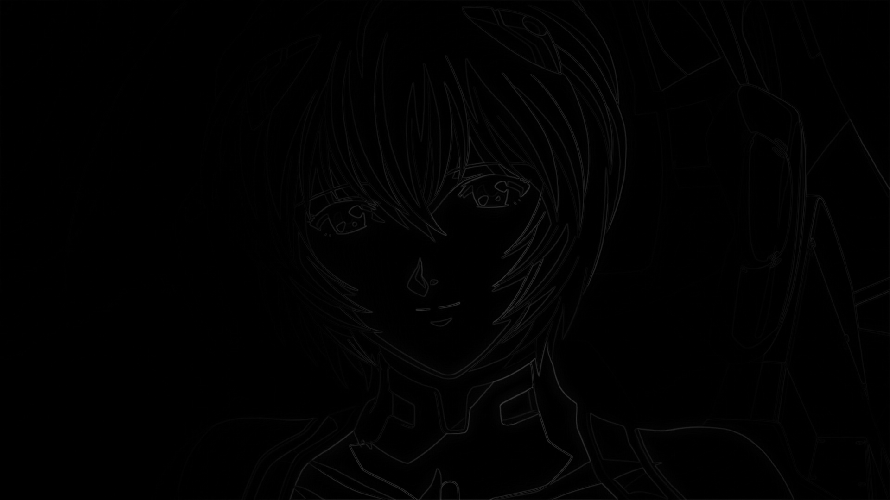

# 1 简单介绍
&emsp;&emsp;这个项目算是一个无聊时做的一个小项目，使用libpng读取png文件，目前只支持了这个，如果需要自己读取其他格式的文件需要自定义添加。然后在此的基础上实现了三个算子梯度，robert和sobel的边缘检测算法。
&emsp;&emsp;程序功能是将输入目录中的所有png文件进行检测之后输出到目标文件中。

# 2 如何编译
## 2.1 windows
&emsp;&emsp;因为我本身实在windows平台上进行工作的，因此windows平台的编译只需要修改库目录就可以，比如：
```bash
set(LIB G:/tmp/interview/edage_detection/lib/lib)
```
&emsp;&emsp;另外编译好的libpng,libzip库存放在lib/lib下，也可以使用自己编译好的版本。准备好之后直接执行cmake编译即可。
```bash
mkdir build 
cd build
cmake ..
make
```
## 2.2 linux
&emsp;&emsp;linux平台需要注意的是这边没有特意为linux平台写适配代码，但是实际上需要改动的地方很少。
&emsp;&emsp;首先要准备相关的库文件，准备工作和windows上无差。然后就是要在代码上修改，需要修改的地方如下：
- ```filesystem.hpp filesystem.cpp```中部分代码是平台相关的需要更换成linux平台下的api，有```GetFileAttributesA```；
- ```notift.hpp notify.cpp```中的部分输出格式设置是平台相关的需要更换成linux平台下的api，有```SetConsoleTextAttribute```；

# 3 如何使用
```bash
        请设置[边缘检测算子][源目录][输出目录]
边缘检测使用规范:
        --arithmetic            选用边缘检测算法算子，可选参数为[robert|sobel|grad]
        --scale                 设置算法参数scale，取值为浮点数
        --main_thread_no        主进程线程池初始化线程数，取值为int
        --thread_no             算法使用线程池初始化线程数，取值为int
        --in                    文件输入目录
        --out                   文件输出目录，不建议和输入目录相同（写文件会覆盖原文件）
        --help                  显示帮助信息
```
&emsp;&emsp;比如：
```bash
detect.exe --in=X:\Users\grayondream\Desktop\1 --out=X:\Users\grayondream\Desktop\2 --main_thread_no=1 --thread_no=6 --arithmetic=grad --scale=0.9
```

# 4 效果图


|算子|scale=0.1|scale=0.3|scale=0.5|scale=0.7|scale=0.9|
|-|-|-|-|-|-|
|grad||||||
|sobel||||||
|roberts||||||